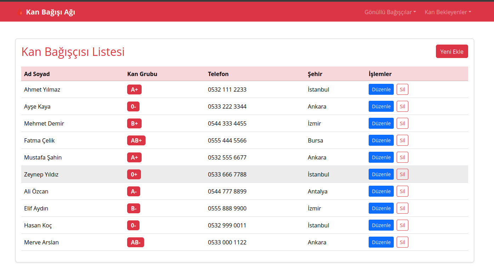
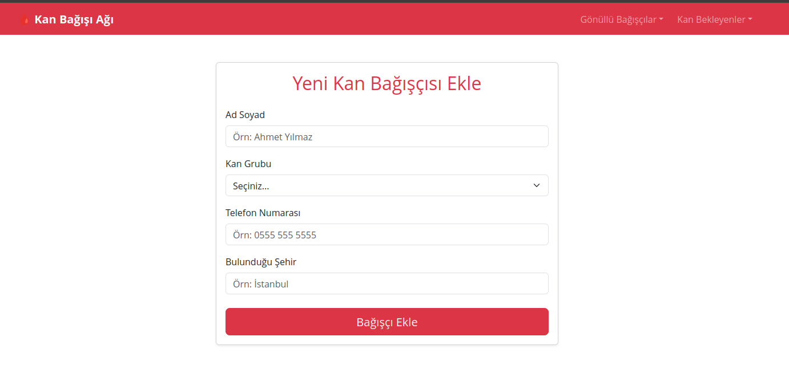
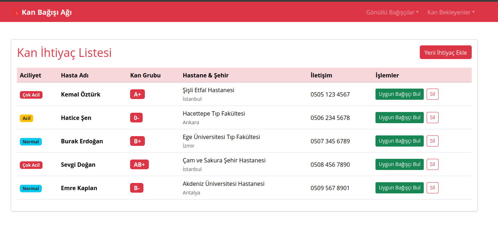
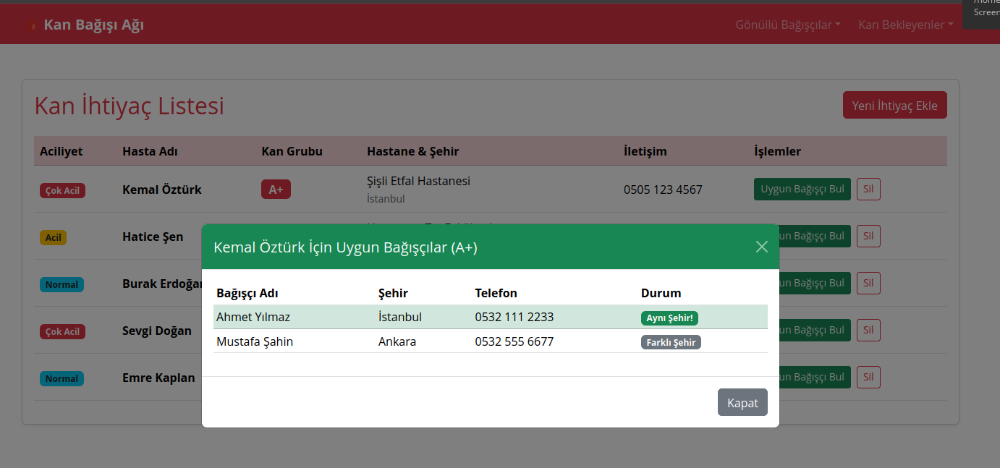
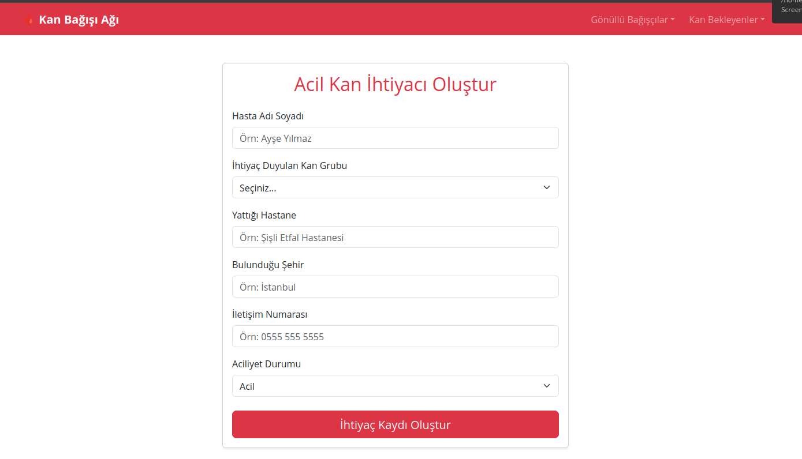

# 🩸 Kan Bağışı Ağı - Vue.js Projesi

Bu proje, kan bağışçısı arayan hastalar ile gönüllü kan bağışçılarını bir araya getiren uçtan uca bir web uygulamasıdır.

## 🚀 Özellikler

- **Bağışçı Yönetimi:** Yeni bağışçı ekleme, listeleme, güncelleme ve silme (CRUD).
- **Kan İhtiyacı Yönetimi:** Aciliyet durumuna göre kan bekleyen hasta kaydı oluşturma.
- **Akıllı Eşleştirme Sistemi:** Hastanın kan grubuna uygun bağışçıları bulma ve aynı şehirde olanları önceliklendirme.
- **Veri Saklama:** Tüm veriler Local Storage kullanılarak tarayıcıda tutulmaktadır.

## 🛠 Kullanılan Teknolojiler

- Vue 3 (Composition API)
- TypeScript
- Vue Router
- Bootstrap 5

## 📸 Ekran Görüntüsü

